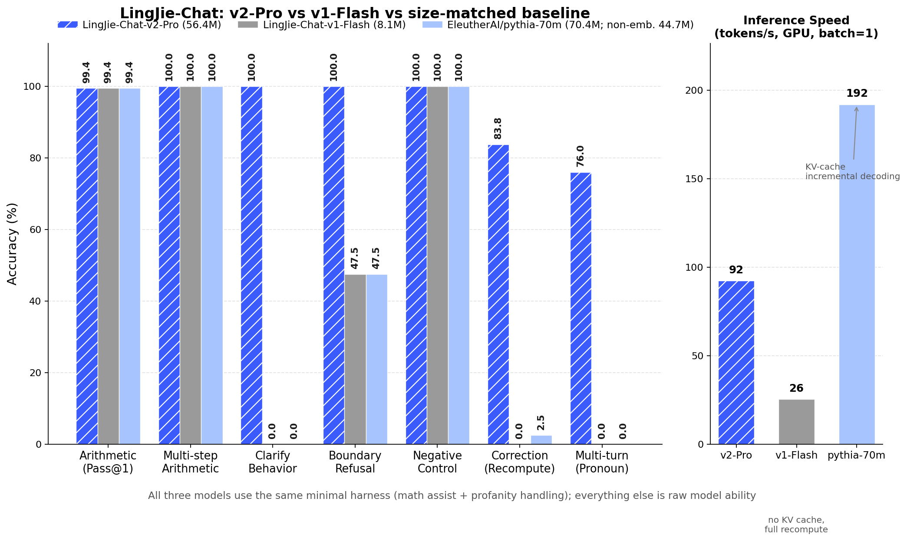

<p align="center"></p>

# LingJie-Chat-v2-Pro（56.4M）

> **版权与原创性声明（Copyright & Originality Statement）**
>
> Copyright © 2026 LingJie2026. All rights reserved.
>
> 本模型（LingJie-Chat-v2-Pro）及其配套代码、Tokenizer、训练数据生成流程、JAM（Joint Attention–Convolution Model）/ GCA-60 架构设计，均为作者 **LingJie2026 独立原创完成**，不依赖任何预训练权重，亦未复制、改编或衍生自任何第三方模型架构或代码库。
>
> **关于 JAM 架构的原创性**：JAM（Joint Attention–Convolution Model，联合注意力-卷积模型，内部代号 GCA-60）是作者**基于 Transformer 范式深度重写、独立设计的原创架构**，其核心创新点包括但不限于：
> 1. 在标准 Transformer Block 中**引入深度因果卷积（depthwise causal conv, k=5）作为独立的第三子层**，形成"注意力 + 卷积 + SwiGLU FFN"三通路联合结构（即 "Joint" 的由来）；
> 2. 针对算术窄域任务设计的**多模块 Head（Intent / Integrity / Parser / Critic / Template / Verb）**，将行为监督从生成 logits 中解耦；
> 3. **数字强制单字切分**的 Tokenizer 配套设计，作为逐位复述计算结果的结构性前提。
>
> 上述设计均为作者原创，**任何关于本模型"抄袭他人"的说法均与事实不符**。JAM 架构虽在思想上受益于 Transformer、RoPE、SwiGLU、深度可分离卷积等公开研究成果（这些工作均已在学术界公开发表并广泛使用），但其**具体架构组合、模块划分、训练配方与工程实现均为作者独立完成**，与任何现有开源模型不存在代码或权重层面的复制关系。
>
> 本仓库代码以 **Apache-2.0** 协议开源；模型权重可自由用于研究与商业用途，但请保留本版权声明。转载请注明出处。
>
> 如对原创性有异议，欢迎通过仓库 Issue 提出具体比对证据，作者愿以代码提交历史、训练日志等材料自证。

---

从零训练的 56.4M 参数窄域对话模型（GCA-60 架构），专注**算术识别 + 工具调用协议 + 行为规范**。
不依赖任何预训练权重：Tokenizer、底模、SFT 全部自行完成。

**LingJie-Chat** 系列：
- **v2-Pro（本仓库，56.4M）**：12 层 / d_model 640 / 多模块 Head，多轮代词指代增强 SFT
- v1-Flash（8.1M，即旧版 Nova LLM）：对照模型

## 架构

| 组件 | 配置 |
|------|------|
| 层数 / 隐藏维度 | 12 层，d_model=640，8 头（RoPE 因果注意力） |
| 子层 | 注意力 → 深度因果卷积 k=5 → SwiGLU FFN(d_ff=1365)，Pre-norm RMSNorm |
| 词表 | 8017（ByteLevel BPE 8000 + 13 特殊 + 4 对话；数字强制单字切分） |
| 上下文 | 1024 |
| 参数 | 56.42M（主干 56.34M + 6 个辅助 Head 0.083M） |
| 训练 | 预训练 1.2B tokens（LR 3e-4）→ SFT 14 万条（LR 1e-5，含 4 万多轮对话） |

## 评测（400 条留出样本 + 50 组多轮对话，三方均接入同一极简 harness）

| 维度 | LingJie-Chat-v2-Pro | LingJie-Chat-v1-Flash (8M) | pythia-70m (non-emb 44.7M) |
|------|------|------|------|
| 算术（Pass@1） | 99.4 | 99.4 | 99.4 |
| 多步复合算术 | 100.0 | 100.0 | 100.0 |
| 澄清行为 | **100.0** | 0 | 0 |
| 边界拒绝 | **100.0** | 47.5 | 47.5 |
| 负样本控制 | 100.0 | 100.0 | 100.0 |
| 纠错重算 | **83.8** | 0 | 2.5 |
| 多轮上下文（代词/追问） | **76.0** | 0 | 0 |
| 推理速度 (tok/s, GPU, batch=1) | 92* | 26 | 192 |

*两个 LingJie 模型推理为无 KV cache 全量重算实现；pythia 为 HF generate() KV-cache 增量解码。
算术类打平是因为三方共享同一个确定性计算 harness——验证"能力分离：模型做识别、工具做计算"的设计。


## 能力边界（诚实声明）

- ✅ 算术识别与计算（+ - * /，≤6 位数字，最多 3 步工具调用）
- ✅ 信息不足时澄清（NEED_INFO）、越界拒绝（CANNOT）、纠错重算
- ✅ 多轮对话中的代词/省略式指代（"their sum"、"that times 2"）
- ❌ 语义纠错、开放域问答、自由生成——超出范围会明确告知 CANNOT
- ❌ 中文（训练语料为英文）

## 快速使用

```python
# 依赖: pip install torch tokenizers
import sys
sys.path.insert(0, "code")
from infer import Pipeline, SpellDict

words = [w.strip() for w in open("data/spell_dict.txt")]
pipe = Pipeline("weights/sft_last.pt", "tokenizer/lingjie_tokenizer.json", SpellDict(words))

print(pipe.answer("What is 1234 plus 567?", minimal=True))
# -> '1234+567 equals 1801.'

# 多轮（minimal=True 使用极简 harness；False 使用完整规则层）
hist = [{"q": "My two numbers are 55 and 18.", "a": "Got it."}]
print(pipe.answer("What is their sum?", minimal=True, history=hist))
```

命令行交互：`python code/infer.py --interactive`

## 文件说明

| 路径 | 说明 |
|------|------|
| `weights/sft_last.pt` | SFT 最终权重（含模型 config） |
| `tokenizer/lingjie_tokenizer.json` | ByteLevel BPE 分词器（8017 词） |
| `data/spell_dict.txt` | 拼写检查词典（TinyStories 词频 Top-100k） |
| `code/` | 模型定义 + 推理管线 + 评测脚本 |
| `training_args.json` | 完整训练超参数 |

## JAM 架构详解

LingJie-Chat-v2-Pro 采用作者独立原创的 **JAM（Joint Attention–Convolution Model，联合注意力-卷积模型）** 架构——
内部代号 GCA-60（Gate-Convolution-Attention, 60M）。设计哲学：**小模型不做通用智能，
在"算术识别 + 工具调用协议"这一窄域做到极致；能力分离——模型负责识别与决策，计算交给工具。**

> **原创性再声明**：JAM 并非对任何现有架构的封装或微调，而是基于 Transformer 范式的**深度重写**。其"注意力 + 深度因果卷积 + SwiGLU"的三通路联合设计、多模块 Head 的行为解耦监督、数字单字切分的 Tokenizer 配套方案，均为作者原创，详见文首版权声明。

### 总体数据流

```
tokens (8017 词表)
    ↓
[词嵌入 8017×640]（与 LM Head 权重共享）
    ↓
12 × JAM Block
    ├── ① Pre-norm RMSNorm → RoPE 因果自注意力（8 头 × 80 维）
    ├── ② Pre-norm RMSNorm → 深度因果卷积（k=5，逐通道）
    ├── ③ Pre-norm RMSNorm → SwiGLU 门控 FFN（d_ff=1365）
    └── 每个子层残差连接
    ↓
[RMSNorm] → [LM Head]（与嵌入共享权重）
    ↓
输出 logits
```

### JAM Block 的三个联合子层

每个 Block 由三条通路**联合**组成，各自捕捉不同尺度的模式，这是 "Joint" 的含义：

**① 全局通路：RoPE 因果自注意力（1.64M 参数/层）**
- 8 头 × 80 维，旋转位置编码（RoPE, theta=10000）
- 负责长程依赖：多轮对话中"their sum"对两轮之前数字的指代、上下文状态追踪

**② 局部通路：深度因果卷积（0.0032M 参数/层，几乎免费）**
- kernel=5、逐通道（depthwise）、左填充因果卷积
- 专为算术设计的归纳偏置：数字串 "1 2 3 4 + 5 6 7" 的位值模式是严格局部的，
  卷积核一眼扫过即可确认数字边界，不必动用注意力
- 这是 JAM 与标准 Transformer 块最大的结构差异：**第三个子层**

**③ 门控通路：SwiGLU FFN（2.62M 参数/层）**
- `down( silu(gate(x)) ⊙ up(x) )`，d_ff=1365（≈2.13× d_model）
- 事实性/模式性计算的主力

三条通路全部 Pre-norm（RMSNorm，无均值中心化，小模型训练更稳）+ 残差。

### 多模块 Head（仅 SFT 激活，0.083M 参数）

主干之外挂 6 个单线性判别头，把"行为"从生成 logits 中解耦出来直接监督：

| Head | 任务 | 类别数 |
|------|------|--------|
| Intent | 是否算术请求 | 2 |
| Integrity | 信息是否完整 | 2 |
| Parser | 数字边界逐 token 标注 | 4 |
| Critic | 表达式与问题一致性 | 2 |
| Template | 回复模板选择 | 100 |
| Verb | 运算动词识别 | 20 |

SFT 损失 = LM 损失（仅 assistant 段）+ 0.3·Intent + 0.2·Integrity + 0.2·Parser + 0.1·Critic + 0.1·Template + 0.1·Verb

### Tokenizer：数字强制单字切分（JAM 的配套设计）

BPE 词表 8017 = ByteLevel BPE 8000 + 13 特殊 token + 4 对话 token。
所有数字在 BPE 前强制按单字符切分（`4827 → 4/8/2/7`），推理时同样处理——
这是模型能逐位复述计算结果的结构性前提。解码永不合并空格，评测用 `normalize_for_eval` 对齐。

### 参数账

| 模块 | 参数量 |
|------|--------|
| 嵌入（与 LM Head 共享） | 5.14M |
| 12 层主干（3×1.64M + 3×2.62M + conv/LN ≈ 4.27M/层） | 51.20M |
| 多模块 Head | 0.083M |
| **合计** | **56.42M** |

### 训练配方

| 阶段 | 数据 | 超参 |
|------|------|------|
| 预训练 | 1.2B tokens（程序生成 89% + TinyStories 11%） | AdamW 3e-4，cosine，batch 256×1024 |
| SFT v2-Pro | 14 万条（6 万单轮 + 4 万多轮对话 + 重放） | AdamW 1e-5，2 epochs，assistant 段掩码 |

完整超参见 `training_args.json`；数据重建流程见下文。

## 仓库结构与下载

| 内容 | 位置 |
|------|------|
| 代码（训练/推理/评测/数据生成） | 本仓库 `code/` 及根目录 |
| SFT 数据（14 万条，含多轮） | `data/sft.jsonl` + `data/sft_multiturn.jsonl` |
| Tokenizer / 拼写词典 | `tokenizer/` `data/spell_dict.txt` |
| **模型权重** | **[Releases](../../releases)**：`sft_last.pt`（SFT 最终版）+ `pretrain_weights.pt`（预训练底模） |

权重文件不进 git（大文件），请从 Release 下载后放到 `weights/` 目录使用。

数据集（TinyStories + 程序生成语料）的完整重建流程见 `gen_pretrain.py` / `gen_curriculum.py` / `gen_sft*.py` / `pack_data.py` 与上文步骤。

## 在线体验

- 魔搭模型页：https://www.modelscope.cn/models/LingJie2026/LingJie-Chat-v2-Pro